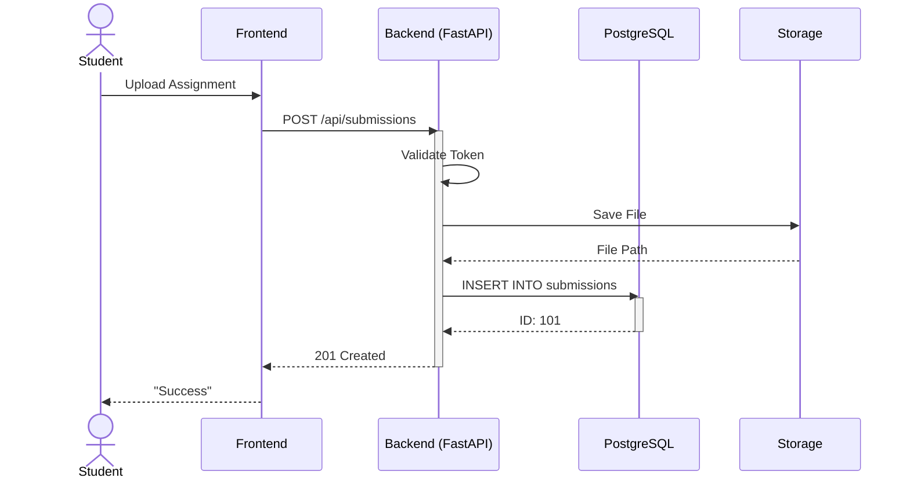
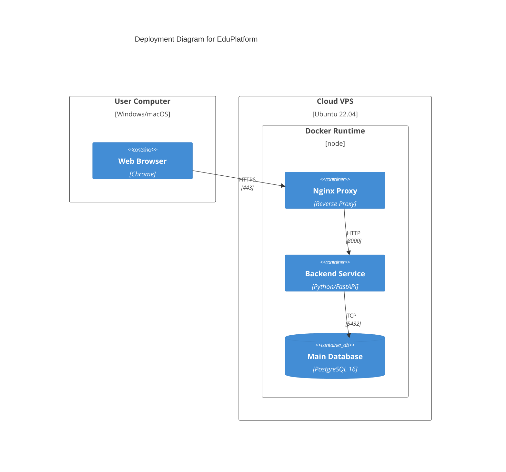

# Product Architecture

## Product choice
* **Name:** EduPlatform (Educational Management System)
* **Description:** A comprehensive platform for colleges in Kazakhstan designed to automate document filling and manage the educational process. It features distinct roles for Administrators, Teachers, and Students.
* **Link:** https://github.com/nurassyl-edu-project (Placeholder)

## Motivation
As a student at JIHC and a backend developer, I am deeply interested in how educational processes can be optimized. Building this system allows me to apply my skills in **FastAPI** and **PostgreSQL** to solve real-world problems. It is a perfect opportunity to practice architecting a role-based access control system.

## Main components

1.  **Web Frontend (SPA):** The user interface for students and teachers. Handles user interactions and displays data.
2.  **API Gateway (Nginx):** The entry point for all requests. Handles reverse proxying and load balancing.
3.  **Backend API (FastAPI):** The core logic. Processes requests, handles business logic (grading, docs), and exposes a REST API.
4.  **Database (PostgreSQL):** Stores user data, courses, grades, and documents.
5.  **Auth Service:** Middleware responsible for JWT authentication and role-based permission checks.

### Component Diagram

**SVG Diagram:**


**PlantUML Source:**
[Component Diagram (.puml)](../diagrams/component-diagram.puml)

**PlantUML Diagram:**
```mermaid
componentDiagram
    component "User Browser" as Client
    component "API Gateway (Nginx)" as Gateway
    component "Backend API (FastAPI)" as Backend
    component "Database (PostgreSQL)" as DB
    component "Document Storage (Local/S3)" as Storage

    Client --> Gateway : HTTPS / JSON
    Gateway --> Backend : Proxied Requests
    Backend --> DB : SQL Queries (SQLAlchemy)
    Backend --> Storage : Save/Load Files
```
Data flow
Scenario: A Student submits a Lab Assignment.

User Action: Student uploads a file via Web Frontend.

Request: Frontend sends POST /api/submissions to Gateway.

Processing:

Backend validates token (Auth).

Backend saves file to Storage.

Backend creates record in PostgreSQL.

Response: Backend returns 201 Created.

### Sequence Diagram

**SVG Diagram:**


**PlantUML Source:**
[Sequence Diagram (.puml)](../diagrams/sequence-diagram.puml)

**PlantUML Diagram:**

Deployment
User Devices: Web browsers.

Server: Cloud VPS (Linux/Ubuntu).

Docker Compose: Orchestrates containers.

Nginx: Exposed port 443.

PostgreSQL: Private volume.

Deployment
User Devices: Web browsers.

Server: Cloud VPS (Linux/Ubuntu).

Docker Compose: Orchestrates containers.

Nginx: Exposed port 443.

PostgreSQL: Private volume.

### Deployment Diagram

**SVG Diagram:**


**PlantUML Source:**
[Deployment Diagram (.puml)](../diagrams/deployment-diagram.puml)

**PlantUML Diagram:**


## System Context Diagram

**Context:** EduPlatform operates within the educational institution's IT ecosystem.

**External Systems:**
- **Student & Teacher Devices:** Web browsers (Chrome, Firefox, Safari)
- **Email Service:** For notifications and password resets
- **Cloud Storage (S3):** For scalable document storage
- **Analytics Service:** For tracking platform usage and performance

**Boundaries:**
- System boundary: Everything within the VPS container
- External entities: Users and third-party services

## Database Schema (Conceptual)

### Core Tables

**users**
```sql
- id (PK)
- username (UNIQUE)
- email (UNIQUE)
- password_hash
- role (ENUM: admin, teacher, student)
- created_at
- updated_at
```

**courses**
```sql
- id (PK)
- code (UNIQUE)
- title
- description
- instructor_id (FK → users)
- semester
- capacity
```

**submissions**
```sql
- id (PK)
- student_id (FK → users)
- assignment_id (FK → assignments)
- file_path
- submitted_at
- grade (nullable)
- feedback (nullable)
```

**assignments**
```sql
- id (PK)
- course_id (FK → courses)
- title
- description
- deadline
- max_points
```

## API Endpoints (Key Resources)

### Authentication
- `POST /api/auth/login` - User login (JWT token)
- `POST /api/auth/logout` - User logout
- `POST /api/auth/refresh` - Refresh JWT token

### Courses
- `GET /api/courses` - List all courses
- `GET /api/courses/{id}` - Get course details
- `POST /api/courses` - Create course (admin only)

### Assignments
- `GET /api/assignments?course_id={id}` - List assignments
- `POST /api/assignments` - Create assignment (teacher)
- `GET /api/assignments/{id}` - Get assignment details

### Submissions
- `POST /api/submissions` - Submit assignment
- `GET /api/submissions/{id}` - Get submission details
- `PUT /api/submissions/{id}/grade` - Grade submission (teacher)

### Users
- `GET /api/users/me` - Get current user profile
- `PUT /api/users/me` - Update profile
- `GET /api/users` - List users (admin only)

## Security Architecture

### Authentication & Authorization
1. **JWT Tokens:** Short-lived access tokens (15 min) + refresh tokens (7 days)
2. **Password Hashing:** Argon2 algorithm for secure password storage
3. **HTTPS/TLS:** All traffic encrypted in transit
4. **CORS Policy:** Restrict cross-origin requests to trusted domains

### Role-Based Access Control (RBAC)
```python
# Middleware decorator example
@app.get("/api/courses")
@require_auth(roles=["admin", "teacher", "student"])
def list_courses(user: User = Depends(get_current_user)):
    return get_user_courses(user)
```

### Database Security
- **SQL Injection Prevention:** SQLAlchemy ORM (parameterized queries)
- **Row-Level Security:** Users can only access their own data
- **Audit Logging:** Track all sensitive operations (logins, grade changes)

## Risks & Mitigation

| Risk | Impact | Mitigation |
|------|--------|-----------|
| **Database Breach** | Loss of student/teacher data | Encrypted passwords, regular backups, VPC isolation |
| **Unauthorized Access** | Students see other students' grades | RBAC middleware, JWT validation on every request |
| **File Storage Overload** | System crashes | S3 migration planned, file size limits enforced |
| **DDoS Attacks** | Service unavailable | Nginx rate limiting, CloudFlare protection |
| **Token Hijacking** | Account compromise | Short expiration times, secure cookie flags |
| **Missing Backups** | Data loss | Daily automated backups to S3 |

## Future Improvements

1. **WebSocket Support** - Real-time notifications for grade releases
2. **API Rate Limiting** - Prevent abuse with per-user quotas
3. **Caching Layer** - Redis for improved performance
4. **Mobile App** - React Native or Flutter application
5. **Analytics Dashboard** - Track student progress and engagement
6. **Payment Integration** - If platform becomes commercial (Stripe/PayPal)
7. **Two-Factor Authentication** - Enhanced security with TOTP or SMS

## Knowledge Gaps

As I deepen my understanding of EduPlatform architecture, I've identified key areas requiring further study:

1. **File Storage Scalability**
   - Current: Local file storage on VPS
   - Gap: Need to learn cloud storage migration (AWS S3, MinIO)
   - Impact: Local storage will become bottleneck with 1000+ students
   - Action: Study boto3 library, S3 bucket policies, lifecycle management

2. **Real-time Communication**
   - Current: Synchronous HTTP/REST API
   - Gap: Need WebSocket implementation for real-time notifications
   - Impact: Teachers cannot receive instant grade submissions or notifications
   - Action: Learn FastAPI WebSocket, socket.io, or gRPC for streaming
   - Timeline: After Docker/testing skills

3. **Database Performance at Scale**
   - Current: Single PostgreSQL instance
   - Gap: No horizontal scaling, indexing strategy incomplete
   - Impact: Database will become bottleneck with 10,000+ concurrent users
   - Action: Study query optimization, connection pooling (pgBouncer), replication
   - Timeline: Q3-Q4 focus
